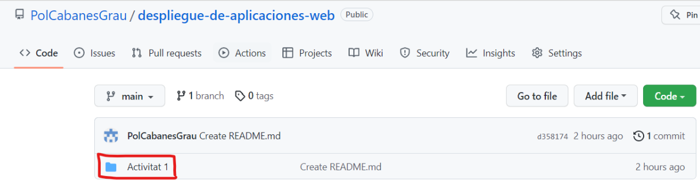

**_1._**

**_2._**

**_3._**

Cuando hablamos del token, nos estamos refiriendo a la própia
contrasenya. Nosotros, los usuarios creamos un usuario con
una contrasenya, y entonces el servidor es el que se encarga
de validar si este token es correcto. 

### **¿Cómo lo hace?**
- El servidor validará que el token sea correcto, 
desencriptandolo mediante la misma llave que utilizo para 
encriptarlo.

### **¿De dónde salen todos los datos sensibles?**
- Cuando hablamos de datos sensibles, hacemos referencia
a los datos personales, pero la diferencia entre uno y otro 
es su proteccion, ya que la de los datos sensibles es mayor.

### **ANALIZA LOS HEADERS**
- **cache-control:** Tiene la función de controlar el 
almacenamiento temporal en navegadores y caches compartidas.

- **content-language:** Te indica el idioma.

- **content-type:** Le dice al usuario que tipo de contenido
será retornado.

- **date:** Representan un momento fijo en el tiempo en 
un formato independiente.

- **expires:** Contiene la fecha y hora en la que se 
considerará que la respuesta está caducada.

- **location:** Representa la ubicación (URL) del objeto al 
que esta vinculado.

- **pragma:** Es un encabezado específico de la implementación
que puede tener varios efectos.

- **server:** El servidor en el que se está ejecutando.

  
- **set-cookie:** Se usa para enviar cookies desde el servidor
al agente de usuario, así el agente de usuario puede 
enviarlos de vuelta al servidor.

- **strict-transport-security:** Es una característica de 
seguridad que permite a un sitio web indicar a los 
navegadores que sólo se debe comunicar con HTTPS en lugar 
de usar HTTP.

- **transfer-encoding:** Es un encabezado, que se aplica a un 
mensaje entre dos nodos, no a un recurso en sí mismo.

- **x-content-type-options:** Es un marcador utilizado por el 
servidor para indicar que los tipos MIME anunciados en los 
encabezados no se deben cambiar ni seguir.

- **x-frame-options:** Este puede usuarse para indicar si 
debería permitírsele a un navegador renderizar una página.

- **x-redirect-by:** Rediriges x cosa con el sistema de gestión
de contenidos que tu quieras, como podría ser Wordpress.

- **x-xss-protection:** Es una característica de Internet 
Explorer, Chrome y Safari que impide la carga de una 
página cuando detecta ataques del tipo Cross-Site

**_4._**

### ¿A qué puerto se reciben normalmente las peticiones del protocolo HTTP?

- En TCP el puerto por defecto en un servidor HTTP es en
el puerto 80.

### ¿A qué capa del modelo TCP/IP se encuentra el protocolo HTTP?

- Corresponde a las capas 5, 6 y 7 del modelo OSI.

### ¿Y los protocolos TCP, UDP, e IP?

- TCP, en la capa 1.
- UDP, en la capa 3.
- IP, en la capa 1 y 2.

**_5._**

### ¿Cuál es el significado de la siguiente respuesta de un servidor?

- **HTTP/1.1 302 Found:** El código de estado 302 
(Encontrado) indica que el recurso de destino reside 
temporalmente en un URI diferente. Dado que la redirección 
puede modificarse en ocasiones, el cliente debe continuar 
utilizando el URI de destino para futuras solicitudes. 
El servidor DEBE generar un campo de encabezado de 
ubicación en la respuesta que contenga una referencia de 
URI para los diferentes URI.

- **Location: http://www.example.com/test/index2.php:** 

**_6._**

He puesto la ip(142.250.200.77) en google y me ha funcionado.

